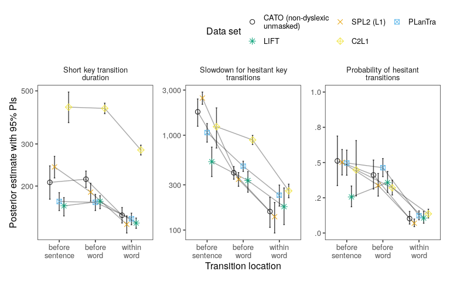
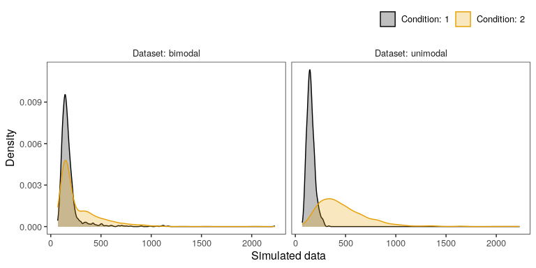
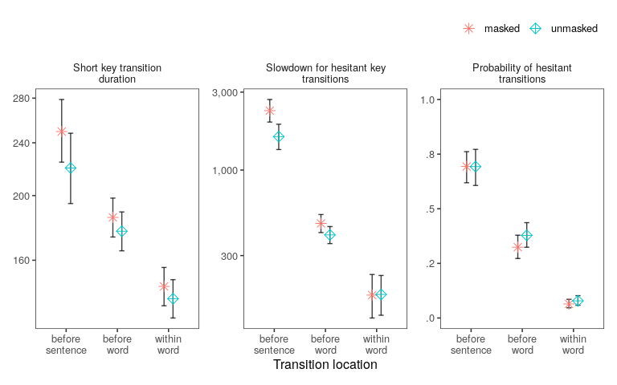
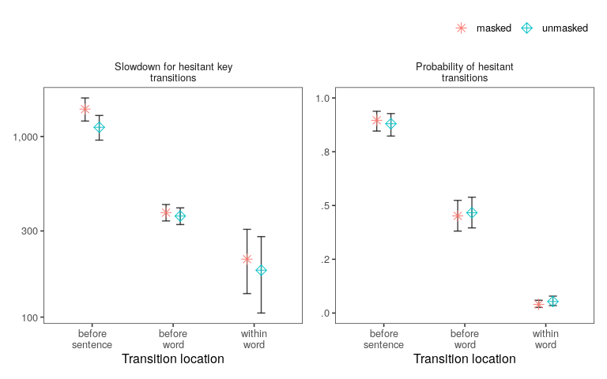
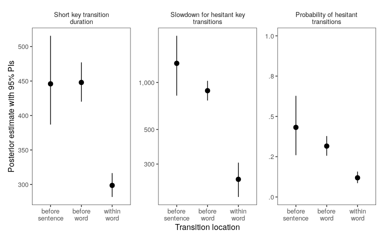
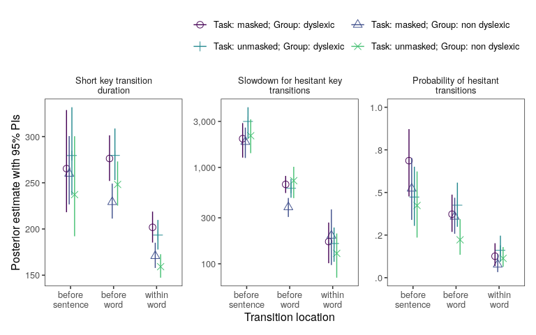
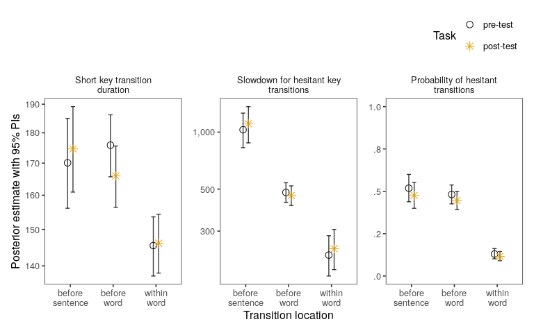
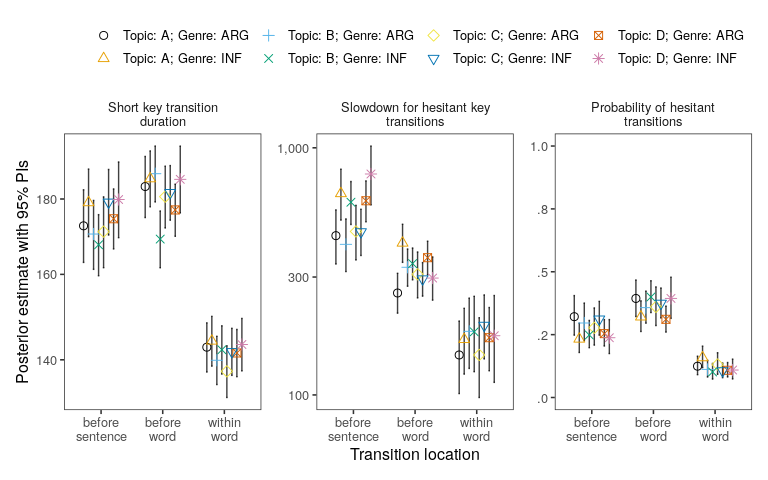
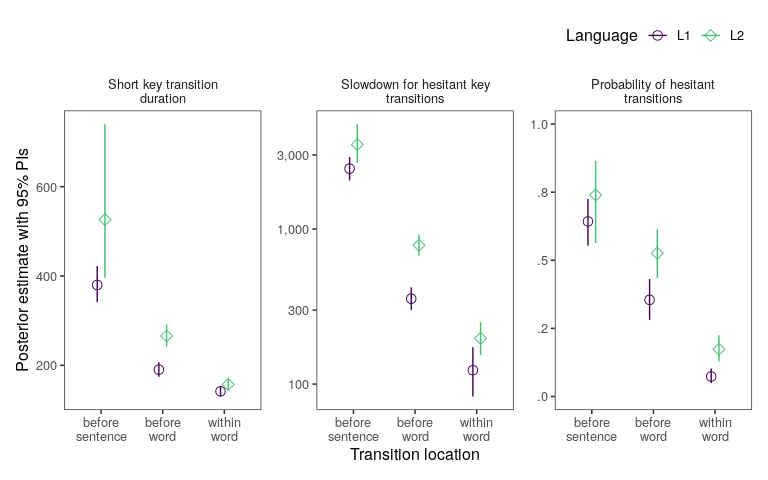

  

# Introduction

# Model definitions

The models presented in the following can be divided into two general groups. The first three models are largely akin to models typically used in the literature. By this we mean models that assume a uni-modal process that generates keystroke data as is incorporated in statistical models such as analysis of variance and linear mixed-effects models. Second, the last two models model keystroke intervals as a combination of two weighted processes of which one presents a smooth information flow from mind into finger; the other component is more important as it represents moments at which the information flow was interrupted leading to longer latencies. The latter two models map directly on the idea of a cascading model of writing.

## Uni-modal Gaussian

We start with a Gaussian mixed-effects models similar to a standard analysis of variance. We describe the process that generates each iki $i$ as normal Gaussian distribution $\text{N}()$ characterised by a mean $\mu$ and a standard deviation $\sigma_\text{e}^2$. The mean can be decomposed into $\beta$ and $\text{participant}_i$. $\beta$ will be allowed to take on a different value for each transition location. Average participant-ikis are allowed to deviate from the average which is achieved by assuming a normal distribution for participant deviations distributed around 0 with a standard deviation $\sigma_\text{p}^2$.

$$
\begin{align}
\text{iki}_i & \sim \text{N}(\mu_i, \sigma_\text{e}^2)\\
\text{where: } & \mu_i = \beta_\text{location[i]} + \text{participant}_i\\
& \text{participant} \sim \text{N}(0, \sigma_\text{p}^2) 
\end{align}
$$

## Uni-modal log-Gaussian

This model is largely identical to the previous model, except we use a log-normal distribution instead of a normal distribution. The advantage of using a log-normal distribution is two-fold: (1) the log-normal distribution has a lower bound of zero. For our data we generally consider negative ikis as mistakes which occasionally occur when the next key was pressed before the current key. Other than that keystroke intervals are constrained by a persons ability to move their fingers and keyboard polling. (2) the log-scale is known to be a better match for data from human behaviour, in particular motor responses. In particular, a normal distribution assumes that units are linearly scaled. For example, a 50 msecs difference is the same between 100 msecs and 150 msecs than it is between 5 secs and 5 secs 50 msecs (i.e. 5,050 msecs). This is not necessarily plausible for keystroke data. We would assume that differences that are due to motor activity (typing a high frequency bigram vs a low frequency bigram) are smaller than difference that are due to high levels of cognitive activity (retrieving a word in your L1 or L2). Log-normal distributions are a natural way of scaling units so that a 50 msecs difference on the lower end of the iki scale (motor activity) is more meaningful than a 50 msecs difference on the upper end of the iki scale (retrieving words, planning sentences).

The model can be described like this:

$$
\begin{align}
\text{iki}_i & \sim \text{logN}(\mu_i, \sigma_\text{e}^2) \\
\text{where: } &
\mu_i = \beta_\text{location[i]} + \text{participant}_i\\
& \text{participant} \sim \text{N}(0, \sigma_\text{p}^2) 
\end{align}
$$

## Uni-modal unequal-variance log-Gaussian

$$
\begin{align}
\text{iki}_i & \sim \text{logN}(\mu_i, \sigma_{e_\text{location[i]}}^2) \\
\text{where: } & \mu_i = \beta_\text{location[i]} + \text{participant}_i\\
 & \text{participant} \sim \text{N}(0, \sigma_\text{p}^2) 
\end{align}
$$

## Bi-modal log-Gaussian (constrained)

This models extends the intuition from the previous model that higher levels of activation lead to longer pauses. Instead of assuming that there is one process that underlies the generation of ikis, we assume there are two. (1) activation can flow into keystrokes without interrupts. These fluent keystroke transitions are merely limited by a person's ability to move their finger and will be captured but the parameter $\beta$. In principle, there are no differences for fluent key-transitions between transition location. The next model with loosen this assumption (hence, "unconstrained model"). (2) difficulty in the activation flow leads to pauses when fingers have to catch-up with cognitive activity, when spelling, words, or contents couldn't be retrieved in time. The size of these pauses will depend on the reason for delays which is typically associated with transition locations (contents are typically planned before sentences, words are retrieved before they are typed and spelling difficulty typically occurs when typing a word). Pauses will be captured by two model parameters: (1) the slowdown for these hesitant transitions will be captured by $\delta$ which is the deviation compared to normal typing intervals (constrained to be positive). (2) the frequency of hesitant transitions will be captured by $\theta$ for each level of a categorical predictor. 

$$
\begin{align}
\text{iki}_{i} & \sim \theta_\text{location[i]} \cdot \text{LogN}(\beta + \delta_\text{location[i]} + \text{participant}_i, \sigma_{e'_\text{location[i]}}^2) + \\
  & (1 - \theta_\text{location[i]}) \cdot \text{LogN}(\beta + \text{participant}_i, \sigma_{e_\text{location[i]}}^2)\\
\text{where: }
		&\delta \sim \text{N}(0,1)\\
 	 & \text{participant} \sim \text{N}(0, \sigma_\text{p}^2) \\
\text{constraint: } & \delta > 0\\
		& \sigma_{e'}^2 > \sigma_{e}^2
\end{align}
$$
This models takes into account two source = s of participant-specific error: (1) each participant has an individual fluent typing as in the previous models; (2) each participant has in individual hesitation frequency that differs across levels of the categorical predictor.

## Bi-modal log-Gaussian (unconstrained)

This model is identical to the previous model with one exception. The distribution of fluent keystroke transitions captured by $\beta$ was fixed to be the same across transition locations is the previous model. In other words, the mean $\beta$ and it's standard deviation $\sigma_{e}^2$ was the same for before-sentence, before-word, and within-word transitions. This means, because of the naturally larger number of within-word transitions, the posterior is dominated by within-word transitions. 

In this model we will loosen this constraint and allow $\beta$ and $\sigma_{e}^2$ to vary by transition-location.

$$
\begin{align}
\text{iki}_{i} &\sim \theta_\text{location[i]} \cdot \text{LogN}(\beta_\text{location[i]} + \delta_\text{location[i]} + \text{participant}_i, \sigma_{e'_\text{location[i]}}^2) + \\
  & (1 - \theta_\text{location[i]}) \cdot \text{LogN}(\beta_\text{location[i]} + \text{participant}_i, \sigma_{e_\text{location[i]}}^2)\\
	\text{where: } & \delta \sim \text{N}(0,1)\\
	 	 & \text{participant} \sim \text{N}(0, \sigma_\text{p}^2) \\
\text{constraint: } & \delta > 0\\
		& \sigma_{e'}^2 > \sigma_{e}^2
\end{align}
$$

# Analysis

We reanalysed data sets including process information from participants writing text. For all data sets we fit a series of four models each with random effects for participants. Probability functions used were normal and log-normal in line with typically treatments used in the literature, a log-normal distribution with unequal variances for model predictions, and a bimodal mixed effects model. Stan code for mixture models was based on @roeser2021modelling. Text locations (levels: before sentence, before word, within word) was included as predictor in all models.

Data were analysed in Bayesian mixed effects models [@gelman2014;@mcelreath2016statistical]. The R [@R-base] package rstan [@rstan] was used to interface with the probabilistic programming language Stan [@carpenter2016stan] which was used to implement all models. Models were fitted with weakly informative priors [see @mcelreath2016statistical], and run with 20,000 iterations on 3 chains with a warm-up of 10,000 iterations and no thinning. Model convergence was confirmed by the Rubin-Gelman statistic ($\hat{R}$ = 1) [@gelman1992] and inspection of the Markov chain Monte Carlo chains.

# Datasets 

## General overview

Five datasets with keystroke data from text production were used for analysis. An overview can be found in Table \@ref(tab:datasets).

<table class="table" style="font-size: 12px; margin-left: auto; margin-right: auto;">
<caption style="font-size: initial !important;">(\#tab:datasets)Datasets in brief.</caption>
 <thead>
  <tr>
   <th style="text-align:left;"> Dataset </th>
   <th style="text-align:left;"> Source </th>
   <th style="text-align:left;"> Keylogger </th>
   <th style="text-align:left;"> Writing task </th>
   <th style="text-align:right;"> N (ppts) </th>
   <th style="text-align:left;"> conditions </th>
   <th style="text-align:right;"> Mean age </th>
   <th style="text-align:left;"> Language </th>
  </tr>
 </thead>
<tbody>
  <tr>
   <td style="text-align:left;"> C2L1 </td>
   <td style="text-align:left;"> @ronneberg2022process </td>
   <td style="text-align:left;"> EyeWrite </td>
   <td style="text-align:left;"> Argumentative essays </td>
   <td style="text-align:right;"> 126 </td>
   <td style="text-align:left;">  </td>
   <td style="text-align:right;"> 11.80 </td>
   <td style="text-align:left;"> Norwegian </td>
  </tr>
  <tr>
   <td style="text-align:left;"> CATO </td>
   <td style="text-align:left;"> @torrance2016adolescent </td>
   <td style="text-align:left;"> EyeWrite </td>
   <td style="text-align:left;"> Expository texts </td>
   <td style="text-align:right;"> 52 </td>
   <td style="text-align:left;"> weak decoders / control; masked / unmasked </td>
   <td style="text-align:right;"> 16.90 </td>
   <td style="text-align:left;"> Norwegian </td>
  </tr>
  <tr>
   <td style="text-align:left;"> SPL2 </td>
   <td style="text-align:left;"> @torrance </td>
   <td style="text-align:left;"> CyWrite </td>
   <td style="text-align:left;"> Argumentative essays </td>
   <td style="text-align:right;"> 39 </td>
   <td style="text-align:left;"> write in L1 / L2 </td>
   <td style="text-align:right;"> 20.60 </td>
   <td style="text-align:left;"> English (L1) / Spanish (L2) </td>
  </tr>
  <tr>
   <td style="text-align:left;"> PLanTra </td>
   <td style="text-align:left;"> @rossetti2022s </td>
   <td style="text-align:left;"> InputLog </td>
   <td style="text-align:left;"> Text simplification </td>
   <td style="text-align:right;"> 47 </td>
   <td style="text-align:left;"> pre / post test trained in plain language principles and control </td>
   <td style="text-align:right;"> 23.00 </td>
   <td style="text-align:left;"> English (L2) </td>
  </tr>
  <tr>
   <td style="text-align:left;"> LIFT </td>
   <td style="text-align:left;"> @nina_vandermeulen_2020_3893538 </td>
   <td style="text-align:left;"> InputLog </td>
   <td style="text-align:left;"> Synthesis </td>
   <td style="text-align:right;"> 658 </td>
   <td style="text-align:left;"> Various topics and genres </td>
   <td style="text-align:right;"> 16.95 </td>
   <td style="text-align:left;"> Dutch </td>
  </tr>
  <tr>
   <td style="text-align:left;"> GUNNEXP2 </td>
   <td style="text-align:left;">  </td>
   <td style="text-align:left;"> EyeWrite </td>
   <td style="text-align:left;">  </td>
   <td style="text-align:right;"> 45 </td>
   <td style="text-align:left;"> masked / unmasked </td>
   <td style="text-align:right;"> NA </td>
   <td style="text-align:left;"> Norwegian </td>
  </tr>
</tbody>
</table>
### GUNNEXP2

### C2L1

The C2L1 data set comprises data Norwegian 6th graders -- *N*=126, mean age 11 years 10 months -- published in @ronneberg2022process. The children composed argumentative essays in Norwegian, a language with a relatively shallow orthography.

TODO: might need to remove kids that don't speak Norwegian at home (see github issue).

### CATO

Data are published in @torrance2016adolescent. Norwegian upper
secondary students--*N*=26, mean age = 16.9 years--with weak decoding skills and 26 age-matched controls composed expository texts by keyboard under two conditions: normally and with letters masked to prevent them reading what they were writing. 

### PLanTra

The PLanTra (Plain Language for Financial Content: Assessing the Impact of Training on Students' Revisions and Readers' Comprehension) data set [@rossetti2022s] involved the collection of keystroke data from 47 university students, who were randomly divided into an experimental and a control group. In a pre-test session, all students were assigned an extract of a corporate report dealing with sustainability and were instructed to revise it to make it easier to read for a lay audience. Subsequently, the experimental group received training on how to apply plain language principles to sustainability content, while the control group received training exclusively on the topic of sustainability. During a post-test session, both groups were instructed to revise a second extract of a corporate sustainability report with the same goal--i.e. making it easier to read for a lay audience--by applying what they had learned from their respective training. The texts were in English while the participants were native speakers of other languages (mainly Dutch), so writing took place in second language. It should be pointed out that, while some students decided to revise the assigned texts, the majority of them opted for rewriting the texts from scratch.

### LIFT

LIFT (Improving Pre-university Students' Performance in Academic Synthesis Tasks with Level-up Instructions and Feedback Tool) [@nina_vandermeulen_2020_3893538].

### SPL2

Data are going to be published in @torrance.

Undergraduate university students--*N* = 39, 28 female, mean age = 20.6 years (SD = 1.51)--wrote two short argumentative essays, one in English (the student's first language in all cases; L1) and one in Spanish (L2) using CyWrite [@chukharev2019combined]. CyWrite provides a writing environment with basic word processing functionality (e.g., Microsoft WordPad), including text selection by mouse action, and copy-and-paste. We recorded the time of each keystroke and mouse action, and tracked writers' eye movements within their emerging text.

Writing tasks: Participants were given a 40 minute time limit. They wrote essays in response to each of two prompts, with order and L1 / L2 counterbalanced across subjects.

##  Transition types

The transition types that were analysed in this study focuses on those locations that were found, by previous research, to be psycholinguistically meaningful [e.g. @torrance; @chukharev2019combined; @torrance2016adolescent; @de2018exploring] and are detailed in Table \@ref(tab:keyloc). Keytransitions that terminated in an editing operation were excluded from the analysis. Transitions that occurred at the beginning of the text or the beginning of a paragraph were not treated as before-sentence transitions.

<table style="NAborder-bottom: 0; font-size: 12px; margin-left: auto; margin-right: auto;" class="table">
<caption style="font-size: initial !important;">(\#tab:keyloc)Transition location classification.</caption>
 <thead>
  <tr>
   <th style="text-align:left;"> Transition type </th>
   <th style="text-align:left;"> Description </th>
   <th style="text-align:left;"> Example </th>
  </tr>
 </thead>
<tbody>
  <tr>
   <td style="text-align:left;"> Within word </td>
   <td style="text-align:left;"> Transitions between any letter </td>
   <td style="text-align:left;"> T\^h\^e c\^a\^t m\^e\^o\^w\^e\^d. T\^h\^a\^t[bsp][bsp]e\^n i\^t s\^l\^e\^p\^t. </td>
  </tr>
  <tr>
   <td style="text-align:left;"> Below word </td>
   <td style="text-align:left;"> Keypress after space followed by any letter </td>
   <td style="text-align:left;"> The \^cat \^meowed. That[bsp][bsp]en \^it \^slept. </td>
  </tr>
  <tr>
   <td style="text-align:left;"> Before sentence </td>
   <td style="text-align:left;"> Keypress following a space preceding any letter </td>
   <td style="text-align:left;"> The cat meowed. \^That[bsp][bsp]en it slept. </td>
  </tr>
</tbody>
<tfoot>
<tr><td style="padding: 0; " colspan="100%">Note: </td></tr>
<tr><td style="padding: 0; " colspan="100%">
 '\^' marks transition location, [bsp] represents backspace. IKIs were timed to the shift keypress.</td></tr>
</tfoot>
</table>

## Data reduction

For all datasets we only used transitions that were not followed by an editing operation.

We removed participants that did not complete all conditions in studies with within-participant factors (reducing the number of participants to 343 in the LIFT data set, and 41 participants in the PLanTra data set). We removed participants that produced less than 10 sentences (LIFT: 109 participants; PLanTra: 3 participants; SPL2: 1 participant)

We removed keystroke intervals that are extremely short ($\le$ 50 msecs) or extremely long ($\ge$ 30 secs). The percentage of remove keystroke data can be found in Table \@ref(tab:datareduction).

From the remaining data we randomly sampled 100 observations per participant, per condition, and per transition location, with the exception of the LIFT data set. This was done for computational reasons to reduce the time the Bayesian models need to complete. For the LIFT data set we reduced the number of participants to 100 which is substantially more than most of the other data sets in our analysis. Because we included the large number of writing tasks in the LIFT data set as fixed effect, we sampled 50 observations per condition, location and participant. The percentage of keystroke data that went into the final analysis can be found, by transition location, in Table \@ref(tab:datareduction).

<table class="table" style="font-size: 11px; margin-left: auto; margin-right: auto;">
<caption style="font-size: initial !important;">(\#tab:datareduction)Data reduction. Mean percentage of extreme data removed and the mean percentage of randomly sampled data by transition locattion. Standard error is shown in parentheses.</caption>
 <thead>
<tr>
<th style="empty-cells: hide;border-bottom:hidden;" colspan="1"></th>
<th style="border-bottom:hidden;padding-bottom:0; padding-left:3px;padding-right:3px;text-align: center; " colspan="2">
Extreme values
</th>
<th style="border-bottom:hidden;padding-bottom:0; padding-left:3px;padding-right:3px;text-align: center; " colspan="3">
Randomly sampled data
</th>
</tr>
  <tr>
   <th style="text-align:left;"> Dataset </th>
   <th style="text-align:right;"> $\le$ 50 msecs </th>
   <th style="text-align:right;"> $\ge$ 30 secs </th>
   <th style="text-align:right;"> before word </th>
   <th style="text-align:right;"> within word </th>
   <th style="text-align:right;"> before sentence </th>
  </tr>
 </thead>
<tbody>
  <tr>
   <td style="text-align:left;width: 8em; "> C2L1 </td>
   <td style="text-align:right;"> 0.19% (0.1%) </td>
   <td style="text-align:right;"> 0.07% (0.06%) </td>
   <td style="text-align:right;"> 84.5% (1.8%) </td>
   <td style="text-align:right;"> 35.1% (2.6%) </td>
   <td style="text-align:right;"> 100% (0%) </td>
  </tr>
  <tr>
   <td style="text-align:left;width: 8em; "> CATO </td>
   <td style="text-align:right;"> 0.65% (0.15%) </td>
   <td style="text-align:right;"> 0.02% (0.02%) </td>
   <td style="text-align:right;"> 48.6% (2.2%) </td>
   <td style="text-align:right;"> 14.9% (0.9%) </td>
   <td style="text-align:right;"> 100% (0%) </td>
  </tr>
  <tr>
   <td style="text-align:left;width: 8em; "> LIFT </td>
   <td style="text-align:right;"> 2.65% (0.16%) </td>
   <td style="text-align:right;"> 0% (0%) </td>
   <td style="text-align:right;"> 13.1% (0.9%) </td>
   <td style="text-align:right;"> 3.2% (0.2%) </td>
   <td style="text-align:right;"> 99.4% (0.1%) </td>
  </tr>
  <tr>
   <td style="text-align:left;width: 8em; "> PLanTra </td>
   <td style="text-align:right;"> 2.49% (0.41%) </td>
   <td style="text-align:right;"> 0.04% (0.03%) </td>
   <td style="text-align:right;"> 36.6% (1.9%) </td>
   <td style="text-align:right;"> 9.7% (0.6%) </td>
   <td style="text-align:right;"> 100% (0%) </td>
  </tr>
  <tr>
   <td style="text-align:left;width: 8em; "> SPL2 </td>
   <td style="text-align:right;"> 2.29% (0.2%) </td>
   <td style="text-align:right;"> 0.03% (0.02%) </td>
   <td style="text-align:right;"> 22.6% (1.4%) </td>
   <td style="text-align:right;"> 5.7% (0.4%) </td>
   <td style="text-align:right;"> 100% (0%) </td>
  </tr>
  <tr>
   <td style="text-align:left;width: 8em; "> GUNNEXP2 </td>
   <td style="text-align:right;"> 2.16% (0.17%) </td>
   <td style="text-align:right;"> 0.01% (0.01%) </td>
   <td style="text-align:right;"> 22.5% (1.4%) </td>
   <td style="text-align:right;"> 6.2% (0.4%) </td>
   <td style="text-align:right;"> 100% (0%) </td>
  </tr>
</tbody>
</table>

# Out-of-samples cross-validation

For model comparisons we used out-of-sample predictions estimated using Pareto smoothed importance-sampling leave-one-out cross-validation [@vehtari2015pareto; @vehtari2017practical]. Predictive performance was estimated as the sum of the expected log predictive density ($\widehat{elpd}$) and the difference $\Delta\widehat{elpd}$ between models. The advantage of using leave-one-out cross-validation is that models with more parameters are penalised to prevent overfit.

Results for all data sets are shown in Table \@ref(tab:loos). For all data sets we found the same pattern. The mixture of log-normal distributions provided a substantially better fit than uni-modal distribution models. The unconstrained version of the mixture of log-normal distributions rendered a higher predictive performance than the constrained version that does not allow the distribution of short keystroke-intervals to vary across conditions. 

<table class="table" style="font-size: 11px; margin-left: auto; margin-right: auto;border-bottom: 0;">
<caption style="font-size: initial !important;">(\#tab:loos)Model comparisons. The top row shows the models with the highest predictive performance. Standard error is shown in parentheses.</caption>
 <thead>
<tr>
<th style="empty-cells: hide;border-bottom:hidden;" colspan="1"></th>
<th style="border-bottom:hidden;padding-bottom:0; padding-left:3px;padding-right:3px;text-align: center; " colspan="2">
GUNNEXP2
</th>
<th style="border-bottom:hidden;padding-bottom:0; padding-left:3px;padding-right:3px;text-align: center; " colspan="2">
CATO
</th>
<th style="border-bottom:hidden;padding-bottom:0; padding-left:3px;padding-right:3px;text-align: center; " colspan="2">
CL21
</th>
<th style="border-bottom:hidden;padding-bottom:0; padding-left:3px;padding-right:3px;text-align: center; " colspan="2">
LIFT
</th>
<th style="border-bottom:hidden;padding-bottom:0; padding-left:3px;padding-right:3px;text-align: center; " colspan="2">
PLanTra
</th>
<th style="border-bottom:hidden;padding-bottom:0; padding-left:3px;padding-right:3px;text-align: center; " colspan="2">
SPL2
</th>
<th style="border-bottom:hidden;padding-bottom:0; padding-left:3px;padding-right:3px;text-align: center; " colspan="2">
SPL2 (shift + C)
</th>
</tr>
  <tr>
   <th style="text-align:left;"> Model </th>
   <th style="text-align:right;"> $\Delta\widehat{elpd}$ </th>
   <th style="text-align:right;"> $\widehat{elpd}$ </th>
   <th style="text-align:right;"> $\Delta\widehat{elpd}$ </th>
   <th style="text-align:right;"> $\widehat{elpd}$ </th>
   <th style="text-align:right;"> $\Delta\widehat{elpd}$ </th>
   <th style="text-align:right;"> $\widehat{elpd}$ </th>
   <th style="text-align:right;"> $\Delta\widehat{elpd}$ </th>
   <th style="text-align:right;"> $\widehat{elpd}$ </th>
   <th style="text-align:right;"> $\Delta\widehat{elpd}$ </th>
   <th style="text-align:right;"> $\widehat{elpd}$ </th>
   <th style="text-align:right;"> $\Delta\widehat{elpd}$ </th>
   <th style="text-align:right;"> $\widehat{elpd}$ </th>
   <th style="text-align:right;"> $\Delta\widehat{elpd}$ </th>
   <th style="text-align:right;"> $\widehat{elpd}$ </th>
  </tr>
 </thead>
<tbody>
  <tr>
   <td style="text-align:left;width: 8em; "> Bimodal log-normal (unconstrained) </td>
   <td style="text-align:right;"> -- </td>
   <td style="text-align:right;"> -120,675 (237) </td>
   <td style="text-align:right;"> -- </td>
   <td style="text-align:right;"> -139,691 (230) </td>
   <td style="text-align:right;"> -- </td>
   <td style="text-align:right;"> -165,434 (231) </td>
   <td style="text-align:right;"> -- </td>
   <td style="text-align:right;"> -272,696 (327) </td>
   <td style="text-align:right;"> -- </td>
   <td style="text-align:right;"> -107,324 (228) </td>
   <td style="text-align:right;"> -- </td>
   <td style="text-align:right;"> -96,671 (217) </td>
   <td style="text-align:right;"> -- </td>
   <td style="text-align:right;"> -97,266 (219) </td>
  </tr>
  <tr>
   <td style="text-align:left;width: 8em; "> Bimodal log-normal (constrained) </td>
   <td style="text-align:right;"> -554 (38) </td>
   <td style="text-align:right;"> -121,228 (235) </td>
   <td style="text-align:right;"> -607 (43) </td>
   <td style="text-align:right;"> -140,298 (230) </td>
   <td style="text-align:right;"> -546 (51) </td>
   <td style="text-align:right;"> -165,980 (237) </td>
   <td style="text-align:right;"> -500 (37) </td>
   <td style="text-align:right;"> -273,197 (327) </td>
   <td style="text-align:right;"> -130 (18) </td>
   <td style="text-align:right;"> -107,454 (228) </td>
   <td style="text-align:right;"> -564 (41) </td>
   <td style="text-align:right;"> -97,234 (216) </td>
   <td style="text-align:right;"> -593 (40) </td>
   <td style="text-align:right;"> -97,859 (219) </td>
  </tr>
  <tr>
   <td style="text-align:left;width: 8em; "> Unimodal log-normal (unequal variance) </td>
   <td style="text-align:right;"> -2,981 (94) </td>
   <td style="text-align:right;"> -123,656 (258) </td>
   <td style="text-align:right;"> -2,389 (79) </td>
   <td style="text-align:right;"> -142,080 (246) </td>
   <td style="text-align:right;"> -2,184 (83) </td>
   <td style="text-align:right;"> -167,617 (256) </td>
   <td style="text-align:right;"> -5,605 (131) </td>
   <td style="text-align:right;"> -278,301 (365) </td>
   <td style="text-align:right;"> -2,514 (92) </td>
   <td style="text-align:right;"> -109,837 (248) </td>
   <td style="text-align:right;"> -1,744 (68) </td>
   <td style="text-align:right;"> -98,415 (224) </td>
   <td style="text-align:right;"> -1,719 (66) </td>
   <td style="text-align:right;"> -98,984 (226) </td>
  </tr>
  <tr>
   <td style="text-align:left;width: 8em; "> Unimodal log-normal </td>
   <td style="text-align:right;"> -5,293 (111) </td>
   <td style="text-align:right;"> -125,968 (263) </td>
   <td style="text-align:right;"> -3,689 (100) </td>
   <td style="text-align:right;"> -143,379 (258) </td>
   <td style="text-align:right;"> -2,968 (98) </td>
   <td style="text-align:right;"> -168,402 (267) </td>
   <td style="text-align:right;"> -7,716 (147) </td>
   <td style="text-align:right;"> -280,412 (375) </td>
   <td style="text-align:right;"> -3,895 (94) </td>
   <td style="text-align:right;"> -111,219 (246) </td>
   <td style="text-align:right;"> -3,457 (81) </td>
   <td style="text-align:right;"> -100,128 (221) </td>
   <td style="text-align:right;"> -3,086 (76) </td>
   <td style="text-align:right;"> -100,351 (223) </td>
  </tr>
  <tr>
   <td style="text-align:left;width: 8em; "> Unimodal normal </td>
   <td style="text-align:right;"> -44,136 (660) </td>
   <td style="text-align:right;"> -164,811 (713) </td>
   <td style="text-align:right;"> -41,362 (927) </td>
   <td style="text-align:right;"> -181,052 (992) </td>
   <td style="text-align:right;"> -40,485 (856) </td>
   <td style="text-align:right;"> -205,919 (935) </td>
   <td style="text-align:right;"> -82,567 (1,691) </td>
   <td style="text-align:right;"> -355,263 (1,779) </td>
   <td style="text-align:right;"> -37,718 (572) </td>
   <td style="text-align:right;"> -145,042 (637) </td>
   <td style="text-align:right;"> -32,174 (450) </td>
   <td style="text-align:right;"> -128,845 (493) </td>
   <td style="text-align:right;"> -32,019 (437) </td>
   <td style="text-align:right;"> -129,284 (477) </td>
  </tr>
</tbody>
<tfoot>
<tr><td style="padding: 0; " colspan="100%">Note: </td></tr>
<tr><td style="padding: 0; " colspan="100%">
 $\widehat{elpd}$ = predictive performance indicated as expected log pointwise predictive density; $\Delta\widehat{elpd}$ = difference in predictive performance relative to the model with the highest predictive performance in the top row.</td></tr>
</tfoot>
</table>

# Cross-data set comparisons

## Cross-data set visualisation

The model estimates for the mixture-model with the highest predictive performance are shown in Figure \@ref(fig:crossstudypost). In this visualisation we ignore dataset specific conditions that are presented in detail below.

(\#fig:crossstudypost)Across studies. Posterior parameter distribution

## Effect of transition location

It's generally believed that pausing is associated with syntactic edges such that more and longer pauses are predicted for key transitions at larger syntactic edges, i.e. before sentence > before word > within word. We have evaluated the differences between transition locations for all data sets. The results are shown in Table \@ref(tab:loceffect). 

Results are largely consistent across data sets (with caveats) but differ, to some extent, from what the literature would predict. In line with the literature hesitations are more frequent before words than within words. Also hesitations are longer at before-sentence transitions compared to before-word transitions (except dataset C2L1) compared to within-word transitions (except dataset LIFT). However, our results do not support that writers pause more frequently at before-sentence locations compared to before-word locations (except for dataset SPL2; this also shows that more pauses at before-sentence locations can not be explained on the basis of multi-key combinations for sentence-initial capitalisation). Also, we observe that even fluent key-transitions are slower at before-word locations compared to within-word locations but there is generally not difference for fluent transitions for before-sentence transitions compared to before-word transitions (except for dataset SPL2).

The datasets differ to the extent that sentence-initial key transitions do (PLanTra, LIFT) or do not (CATO, C2L1, SPL2) include the character following the shift key for capitalisation. In other words, the pause before sentences may sum across two key intervals, namely `_^[shift]^C` but only involves one keyintervals, namely `_^[shift]`. For the SPL2 dataset, we calculated location effects for sentence-initial transitions that do and do not involve the shift-to-key transition. The results were the same for the transition location effects. A comparison that is untangling the effects of the multi-keycombination on the mixture-model estimates can be found in Table \@ref(tab:shiftcellmeans). In short, the duration of fluent transitions and the hesitation slowdown are affected but not the hesitation probability.

In conclusion, while pauses tend to be longer before sentences they are not more frequent than before words.

<table class="table" style="font-size: 11px; margin-left: auto; margin-right: auto;border-bottom: 0;">
<caption style="font-size: initial !important;">(\#tab:loceffect)Effect of transition location on keystroke intervals. Differences between transition locations are shown on log scale (for transition durations) and logit scale for probability of hesitant transitions. 95% PIs in brackets.</caption>
 <thead>
<tr>
<th style="empty-cells: hide;border-bottom:hidden;" colspan="2"></th>
<th style="border-bottom:hidden;padding-bottom:0; padding-left:3px;padding-right:3px;text-align: center; " colspan="2">
Fluent transitions
</th>
<th style="border-bottom:hidden;padding-bottom:0; padding-left:3px;padding-right:3px;text-align: center; " colspan="2">
Slowdown for hesitations
</th>
<th style="border-bottom:hidden;padding-bottom:0; padding-left:3px;padding-right:3px;text-align: center; " colspan="2">
Probability of hesitations
</th>
</tr>
  <tr>
   <th style="text-align:left;"> Data set </th>
   <th style="text-align:left;"> Difference </th>
   <th style="text-align:right;"> Est. with 95% PIs </th>
   <th style="text-align:right;"> BF </th>
   <th style="text-align:right;"> Est. with 95% PIs </th>
   <th style="text-align:right;"> BF </th>
   <th style="text-align:right;"> Est. with 95% PIs </th>
   <th style="text-align:right;"> BF </th>
  </tr>
 </thead>
<tbody>
  <tr>
   <td style="text-align:left;vertical-align: middle !important;width: 3cm; " rowspan="2"> C2L1 </td>
   <td style="text-align:left;"> before sentence vs word </td>
   <td style="text-align:right;"> 0.01 [-0.13, 0.15] </td>
   <td style="text-align:right;"> 0.07 </td>
   <td style="text-align:right;"> 0.21 [-0.13, 0.54] </td>
   <td style="text-align:right;"> 0.35 </td>
   <td style="text-align:right;"> 0.54 [-0.31, 1.43] </td>
   <td style="text-align:right;"> 0.89 </td>
  </tr>
  <tr>
   
   <td style="text-align:left;width: 3cm; "> before vs within word </td>
   <td style="text-align:right;"> 0.4 [0.38, 0.42] </td>
   <td style="text-align:right;"> &gt; 100 </td>
   <td style="text-align:right;"> 0.49 [0.39, 0.58] </td>
   <td style="text-align:right;"> &gt; 100 </td>
   <td style="text-align:right;"> 1.1 [0.76, 1.44] </td>
   <td style="text-align:right;"> &gt; 100 </td>
  </tr>
  <tr>
   <td style="text-align:left;vertical-align: middle !important;width: 3cm; " rowspan="2"> CATO (non-dyslexic
unmasked) </td>
   <td style="text-align:left;"> before sentence vs word </td>
   <td style="text-align:right;"> -0.03 [-0.18, 0.11] </td>
   <td style="text-align:right;"> 0.08 </td>
   <td style="text-align:right;"> 1.19 [0.88, 1.49] </td>
   <td style="text-align:right;"> &gt; 100 </td>
   <td style="text-align:right;"> 0.41 [-0.44, 1.27] </td>
   <td style="text-align:right;"> 0.67 </td>
  </tr>
  <tr>
   
   <td style="text-align:left;width: 3cm; "> before vs within word </td>
   <td style="text-align:right;"> 0.35 [0.31, 0.38] </td>
   <td style="text-align:right;"> &gt; 100 </td>
   <td style="text-align:right;"> 0.35 [0.14, 0.54] </td>
   <td style="text-align:right;"> 17.48 </td>
   <td style="text-align:right;"> 1.83 [1.19, 2.49] </td>
   <td style="text-align:right;"> &gt; 100 </td>
  </tr>
  <tr>
   <td style="text-align:left;vertical-align: middle !important;width: 3cm; " rowspan="2"> GUNNEXP2 (unmasked) </td>
   <td style="text-align:left;"> before sentence vs word </td>
   <td style="text-align:right;"> 0.22 [0.12, 0.32] </td>
   <td style="text-align:right;"> &gt; 100 </td>
   <td style="text-align:right;"> 0.93 [0.78, 1.07] </td>
   <td style="text-align:right;"> &gt; 100 </td>
   <td style="text-align:right;"> 1.32 [0.86, 1.78] </td>
   <td style="text-align:right;"> &gt; 100 </td>
  </tr>
  <tr>
   
   <td style="text-align:left;width: 3cm; "> before vs within word </td>
   <td style="text-align:right;"> 0.23 [0.21, 0.25] </td>
   <td style="text-align:right;"> &gt; 100 </td>
   <td style="text-align:right;"> 0.38 [0.21, 0.54] </td>
   <td style="text-align:right;"> &gt; 100 </td>
   <td style="text-align:right;"> 1.97 [1.59, 2.37] </td>
   <td style="text-align:right;"> &gt; 100 </td>
  </tr>
  <tr>
   <td style="text-align:left;vertical-align: middle !important;width: 3cm; " rowspan="2"> LIFT </td>
   <td style="text-align:left;"> before sentence vs word </td>
   <td style="text-align:right;"> -0.04 [-0.13, 0.05] </td>
   <td style="text-align:right;"> 0.07 </td>
   <td style="text-align:right;"> 0.35 [0.05, 0.72] </td>
   <td style="text-align:right;"> 2.14 </td>
   <td style="text-align:right;"> -0.49 [-1.03, 0] </td>
   <td style="text-align:right;"> 1.63 </td>
  </tr>
  <tr>
   
   <td style="text-align:left;width: 3cm; "> before vs within word </td>
   <td style="text-align:right;"> 0.21 [0.13, 0.27] </td>
   <td style="text-align:right;"> &gt; 100 </td>
   <td style="text-align:right;"> 0.26 [-0.16, 0.55] </td>
   <td style="text-align:right;"> 0.71 </td>
   <td style="text-align:right;"> 1.56 [1.02, 2.16] </td>
   <td style="text-align:right;"> &gt; 100 </td>
  </tr>
  <tr>
   <td style="text-align:left;vertical-align: middle !important;width: 3cm; " rowspan="2"> PLanTra </td>
   <td style="text-align:left;"> before sentence vs word </td>
   <td style="text-align:right;"> 0.01 [-0.09, 0.11] </td>
   <td style="text-align:right;"> 0.07 </td>
   <td style="text-align:right;"> 0.65 [0.46, 0.83] </td>
   <td style="text-align:right;"> &gt; 100 </td>
   <td style="text-align:right;"> 0.13 [-0.25, 0.53] </td>
   <td style="text-align:right;"> 0.25 </td>
  </tr>
  <tr>
   
   <td style="text-align:left;width: 3cm; "> before vs within word </td>
   <td style="text-align:right;"> 0.16 [0.1, 0.21] </td>
   <td style="text-align:right;"> &gt; 100 </td>
   <td style="text-align:right;"> 0.37 [0.2, 0.54] </td>
   <td style="text-align:right;"> &gt; 100 </td>
   <td style="text-align:right;"> 1.83 [1.48, 2.17] </td>
   <td style="text-align:right;"> &gt; 100 </td>
  </tr>
  <tr>
   <td style="text-align:left;vertical-align: middle !important;width: 3cm; " rowspan="2"> SPL2 (L1; shift + C) </td>
   <td style="text-align:left;"> before sentence vs word </td>
   <td style="text-align:right;"> 0.73 [0.66, 0.81] </td>
   <td style="text-align:right;"> &gt; 100 </td>
   <td style="text-align:right;"> 0.92 [0.78, 1.07] </td>
   <td style="text-align:right;"> &gt; 100 </td>
   <td style="text-align:right;"> 1.16 [0.64, 1.69] </td>
   <td style="text-align:right;"> &gt; 100 </td>
  </tr>
  <tr>
   
   <td style="text-align:left;width: 3cm; "> before vs within word </td>
   <td style="text-align:right;"> 0.3 [0.27, 0.34] </td>
   <td style="text-align:right;"> &gt; 100 </td>
   <td style="text-align:right;"> 0.35 [0.15, 0.54] </td>
   <td style="text-align:right;"> 22.82 </td>
   <td style="text-align:right;"> 1.84 [1.33, 2.35] </td>
   <td style="text-align:right;"> &gt; 100 </td>
  </tr>
  <tr>
   <td style="text-align:left;vertical-align: middle !important;width: 3cm; " rowspan="2"> SPL2 (L1) </td>
   <td style="text-align:left;"> before sentence vs word </td>
   <td style="text-align:right;"> 0.24 [0.17, 0.31] </td>
   <td style="text-align:right;"> &gt; 100 </td>
   <td style="text-align:right;"> 1.39 [1.25, 1.52] </td>
   <td style="text-align:right;"> &gt; 100 </td>
   <td style="text-align:right;"> 0.69 [0.17, 1.19] </td>
   <td style="text-align:right;"> 8.01 </td>
  </tr>
  <tr>
   
   <td style="text-align:left;width: 3cm; "> before vs within word </td>
   <td style="text-align:right;"> 0.31 [0.28, 0.34] </td>
   <td style="text-align:right;"> &gt; 100 </td>
   <td style="text-align:right;"> 0.35 [0.14, 0.54] </td>
   <td style="text-align:right;"> 16.25 </td>
   <td style="text-align:right;"> 1.94 [1.4, 2.5] </td>
   <td style="text-align:right;"> &gt; 100 </td>
  </tr>
</tbody>
<tfoot>
<tr><td style="padding: 0; " colspan="100%">Note: </td></tr>
<tr><td style="padding: 0; " colspan="100%">
 PIs are probability intervals. BF is the evidence in favour of the alternative hypothesis over the null hypothesis.</td></tr>
</tfoot>
</table>

# Model comparison with simulated data

A general concern with mixture models is that in principle, as the mixture model has more parameters it might simply always lead to a better fit, even though cross-validation is addressing potential problems with overfitting models.

To address this concern we simulated two sets of data. Both data sets have two conditions and 1,000 observations each. The first set of data has as underlying data generating process a mixture model with two mixture components similar to the process described above. The difference between the two conditions is that the mixing proportion is larger for condition 2 than for condition 1, hence long observations are more likely in condition 2. This model can be summarised as followed:

$$
\text{y}_i \sim \theta_\text{condition[i]} \cdot \text{logN}(\mu_1, \sigma^2_1) +\\
(1 - \theta_\text{condition[i]}) \cdot \text{logN}(\mu_2, \sigma^2_2)
$$

The second data set was generated with an unequal variance unimodal model as data generating process. Condition 2 has a larger mean and standard deviation than condition 1. The model can be summaried as followed:

$$
\text{y}_i \sim \text{logN}(\mu_\text{condition[i]}, \sigma^2_\text{condition[i]})
$$

The true parameter values used for each of the two data simulations can be found in Table \@ref(tab:simparam). The simulated data are visualised in Figure \@ref(fig:simdata). The data are simulated to be similarly distributed to keystroke transitions.

(\#fig:simdata)Data simulated with a bimodal process (left) and a unimodal process (right).

We run 4 models: 2 mixture models, one on the data generated with a mixture process and one on the data generated with the unimodal unequal variance process. We repeated the same using an unimodal unequal variance model. Models were run with 3 chains, with each 6,000 iterations of which 3,000 were warmup. The Stan models uncovered the model parameters of their respective data sets successfully, as shown in Table \@ref(tab:simparam), not less so when the model was applied to data generated with the other underlying process.

<table class="table" style="font-size: 11px; width: auto !important; margin-left: auto; margin-right: auto;">
<caption style="font-size: initial !important;">(\#tab:simparam)Uncovered parameter estimates with 95% probability interval (PI) and true parameter values for each simulated data set and by model and their respective parameters.</caption>
 <thead>
<tr>
<th style="empty-cells: hide;border-bottom:hidden;" colspan="1"></th>
<th style="empty-cells: hide;border-bottom:hidden;" colspan="1"></th>
<th style="border-bottom:hidden;padding-bottom:0; padding-left:3px;padding-right:3px;text-align: center; " colspan="2">
Estimate with 95\% PI
</th>
</tr>
  <tr>
   <th style="text-align:left;"> Parameter </th>
   <th style="text-align:right;"> True value </th>
   <th style="text-align:right;"> Bimodal data </th>
   <th style="text-align:right;"> Unimodal data </th>
  </tr>
 </thead>
<tbody>
  <tr grouplength="6"><td colspan="4" style="border-bottom: 1px solid;"><strong>Model: Bimodal mixture model</strong></td></tr>
<tr>
   <td style="text-align:left;padding-left: 2em;" indentlevel="1"> $\beta$ </td>
   <td style="text-align:right;"> 5 </td>
   <td style="text-align:right;"> 5 [4.98, 5.01] </td>
   <td style="text-align:right;"> 5 [4.99, 5.02] </td>
  </tr>
  <tr>
   <td style="text-align:left;padding-left: 2em;" indentlevel="1"> $\delta$ </td>
   <td style="text-align:right;"> 1 </td>
   <td style="text-align:right;"> 0.99 [0.9, 1.06] </td>
   <td style="text-align:right;"> 1.04 [1, 1.08] </td>
  </tr>
  <tr>
   <td style="text-align:left;padding-left: 2em;" indentlevel="1"> $\theta_\text{condition=1}$ </td>
   <td style="text-align:right;"> .10 </td>
   <td style="text-align:right;"> .09 [.07, .12] </td>
   <td style="text-align:right;"> .01 [.00, .01] </td>
  </tr>
  <tr>
   <td style="text-align:left;padding-left: 2em;" indentlevel="1"> $\theta_\text{condition=2}$ </td>
   <td style="text-align:right;"> .40 </td>
   <td style="text-align:right;"> .42 [.38, .47] </td>
   <td style="text-align:right;"> .97 [.95, .99] </td>
  </tr>
  <tr>
   <td style="text-align:left;padding-left: 2em;" indentlevel="1"> $\sigma^2_1$ </td>
   <td style="text-align:right;"> 0.25 </td>
   <td style="text-align:right;"> 0.25 [0.24, 0.26] </td>
   <td style="text-align:right;"> 0.25 [0.24, 0.26] </td>
  </tr>
  <tr>
   <td style="text-align:left;padding-left: 2em;" indentlevel="1"> $\sigma^2_2$ </td>
   <td style="text-align:right;"> 0.5 </td>
   <td style="text-align:right;"> 0.48 [0.43, 0.54] </td>
   <td style="text-align:right;"> 0.48 [0.46, 0.51] </td>
  </tr>
  <tr grouplength="4"><td colspan="4" style="border-bottom: 1px solid;"><strong>Model: Unimodal process</strong></td></tr>
<tr>
   <td style="text-align:left;padding-left: 2em;" indentlevel="1"> $\beta_\text{condition=1}$ </td>
   <td style="text-align:right;"> 5 </td>
   <td style="text-align:right;"> 5.1 [5.07, 5.12] </td>
   <td style="text-align:right;"> 5 [4.99, 5.02] </td>
  </tr>
  <tr>
   <td style="text-align:left;padding-left: 2em;" indentlevel="1"> $\beta_\text{condition=2}$ </td>
   <td style="text-align:right;"> 6 </td>
   <td style="text-align:right;"> 5.41 [5.37, 5.44] </td>
   <td style="text-align:right;"> 6.02 [5.99, 6.05] </td>
  </tr>
  <tr>
   <td style="text-align:left;padding-left: 2em;" indentlevel="1"> $\sigma_\text{condition=1}$ </td>
   <td style="text-align:right;"> 0.25 </td>
   <td style="text-align:right;"> 0.4 [0.38, 0.42] </td>
   <td style="text-align:right;"> 0.25 [0.24, 0.26] </td>
  </tr>
  <tr>
   <td style="text-align:left;padding-left: 2em;" indentlevel="1"> $\sigma_\text{condition=2}$ </td>
   <td style="text-align:right;"> 0.5 </td>
   <td style="text-align:right;"> 0.61 [0.59, 0.64] </td>
   <td style="text-align:right;"> 0.51 [0.48, 0.53] </td>
  </tr>
</tbody>
</table>

We used LOO-CV to compare the fit of the two models for each data set. The model comparisons can be found for each data generating process in Table \ref@(tab:loossim). The results show that the mixture model does not always lead to higher predictive performance. Indeed, the mixture model showed a lower predictive performance for the data that were generated with a unimodal process. However, for the data generated with a bimodal process, the mixture model model shows a higher predictive performance. In fact, the ratio of $\Delta\widehat{elpd}$ and its SE, as metric for the strength of evidence, shows that the mixture model performs 11 times better than the unimodal model for the data generated with a bimodal process. In comparison, for the unimodal data, the unimodal model shows only 3 times better than the bimodal mixture model. Thus, even though the mixture model does not necessarily perform better for non-bimodal data but it also doesn't necessarily perform much worse. This contrast is likely a reflection of the increased number of parameters in the mixture model. 

<table class="table" style="font-size: 11px; width: auto !important; margin-left: auto; margin-right: auto;border-bottom: 0;">
<caption style="font-size: initial !important;">(\#tab:loossim)Model comparisons by data set. The top row shows the models with the highest predictive performance. Standard error is shown in parentheses.</caption>
 <thead>
  <tr>
   <th style="text-align:left;"> Model </th>
   <th style="text-align:right;"> $\Delta\widehat{elpd}$ </th>
   <th style="text-align:right;"> $\widehat{elpd}$ </th>
  </tr>
 </thead>
<tbody>
  <tr grouplength="2"><td colspan="3" style="border-bottom: 1px solid;"><strong>Data: Bimodal mixture process</strong></td></tr>
<tr>
   <td style="text-align:left;padding-left: 2em;" indentlevel="1"> Bimodal mixture model </td>
   <td style="text-align:right;"> 0 (0) </td>
   <td style="text-align:right;"> -11,614 (58) </td>
  </tr>
  <tr>
   <td style="text-align:left;padding-left: 2em;" indentlevel="1"> Unimodal unequal-variance model </td>
   <td style="text-align:right;"> -325 (30) </td>
   <td style="text-align:right;"> -11,939 (66) </td>
  </tr>
  <tr grouplength="2"><td colspan="3" style="border-bottom: 1px solid;"><strong>Data: Unimodal process</strong></td></tr>
<tr>
   <td style="text-align:left;padding-left: 2em;" indentlevel="1"> Unimodal unequal-variance model </td>
   <td style="text-align:right;"> 0 (0) </td>
   <td style="text-align:right;"> -11,788 (53) </td>
  </tr>
  <tr>
   <td style="text-align:left;padding-left: 2em;" indentlevel="1"> Bimodal mixture model </td>
   <td style="text-align:right;"> -6 (2) </td>
   <td style="text-align:right;"> -11,794 (53) </td>
  </tr>
</tbody>
<tfoot>
<tr><td style="padding: 0; " colspan="100%">Note: </td></tr>
<tr><td style="padding: 0; " colspan="100%">
 $\widehat{elpd}$ = predictive performance indicated as expected log pointwise predictive density; $\Delta\widehat{elpd}$ = difference in predictive performance relative to the model with the highest predictive performance in the top row.</td></tr>
</tfoot>
</table>

## Posterior parameter estimates of mixture model

### GUNNEXP2

#### Unconstrained mixture model

##### Posterior parameter estimates

(\#fig:gunnpostun)GUNNEXP2 (unconstrained model). Posterior parameter distribution

##### Masking effect

<table class="table" style="margin-left: auto; margin-right: auto;border-bottom: 0;">
<caption>(\#tab:shiftcellmeansgunn)Mixture model estimates for key transitions. Cell means are shown for the masked and unmasked writing task in msecs for fluent key-transitions, the slowdown for long transitions and the probability of disfluent transitions. The effect for masking is shown on log scale (for transition durations) and logit scale for probability of disfluent transitions. 95% PIs in brackets.</caption>
 <thead>
  <tr>
   <th style="text-align:left;"> Transition location </th>
   <th style="text-align:right;"> Unmasked </th>
   <th style="text-align:right;"> Masked </th>
   <th style="text-align:right;"> Difference </th>
   <th style="text-align:right;"> BF </th>
  </tr>
 </thead>
<tbody>
  <tr grouplength="3"><td colspan="5" style="border-bottom: 1px solid;"><strong>Fluent transitions</strong></td></tr>
<tr>
   <td style="text-align:left;padding-left: 2em;" indentlevel="1"> before sentence </td>
   <td style="text-align:right;"> 220 [195, 248] </td>
   <td style="text-align:right;"> 250 [224, 279] </td>
   <td style="text-align:right;"> 0.13 [0.02, 0.23] </td>
   <td style="text-align:right;"> 1.01 </td>
  </tr>
  <tr>
   <td style="text-align:left;padding-left: 2em;" indentlevel="1"> before word </td>
   <td style="text-align:right;"> 177 [165, 189] </td>
   <td style="text-align:right;"> 185 [173, 198] </td>
   <td style="text-align:right;"> 0.05 [0.03, 0.07] </td>
   <td style="text-align:right;"> 70.05 </td>
  </tr>
  <tr>
   <td style="text-align:left;padding-left: 2em;" indentlevel="1"> within word </td>
   <td style="text-align:right;"> 140 [131, 150] </td>
   <td style="text-align:right;"> 146 [137, 156] </td>
   <td style="text-align:right;"> 0.04 [0.03, 0.06] </td>
   <td style="text-align:right;"> &gt; 100 </td>
  </tr>
  <tr grouplength="3"><td colspan="5" style="border-bottom: 1px solid;"><strong>Disfluencies</strong></td></tr>
<tr>
   <td style="text-align:left;padding-left: 2em;" indentlevel="1"> before sentence </td>
   <td style="text-align:right;"> 1,602 [1,336, 1,908] </td>
   <td style="text-align:right;"> 2,310 [1,968, 2,703] </td>
   <td style="text-align:right;"> 0.21 [0.05, 0.38] </td>
   <td style="text-align:right;"> 1.97 </td>
  </tr>
  <tr>
   <td style="text-align:left;padding-left: 2em;" indentlevel="1"> before word </td>
   <td style="text-align:right;"> 401 [355, 451] </td>
   <td style="text-align:right;"> 472 [415, 535] </td>
   <td style="text-align:right;"> 0.08 [-0.02, 0.18] </td>
   <td style="text-align:right;"> 0.18 </td>
  </tr>
  <tr>
   <td style="text-align:left;padding-left: 2em;" indentlevel="1"> within word </td>
   <td style="text-align:right;"> 173 [129, 227] </td>
   <td style="text-align:right;"> 172 [124, 230] </td>
   <td style="text-align:right;"> -0.03 [-0.24, 0.19] </td>
   <td style="text-align:right;"> 0.11 </td>
  </tr>
  <tr grouplength="3"><td colspan="5" style="border-bottom: 1px solid;"><strong>Probability of disfluencies</strong></td></tr>
<tr>
   <td style="text-align:left;padding-left: 2em;" indentlevel="1"> before sentence </td>
   <td style="text-align:right;"> .69 [.61, .77] </td>
   <td style="text-align:right;"> .69 [.62, .76] </td>
   <td style="text-align:right;"> 0 [-0.45, 0.45] </td>
   <td style="text-align:right;"> 0.23 </td>
  </tr>
  <tr>
   <td style="text-align:left;padding-left: 2em;" indentlevel="1"> before word </td>
   <td style="text-align:right;"> .38 [.32, .44] </td>
   <td style="text-align:right;"> .32 [.27, .38] </td>
   <td style="text-align:right;"> -0.24 [-0.57, 0.09] </td>
   <td style="text-align:right;"> 0.46 </td>
  </tr>
  <tr>
   <td style="text-align:left;padding-left: 2em;" indentlevel="1"> within word </td>
   <td style="text-align:right;"> .08 [.06, .10] </td>
   <td style="text-align:right;"> .06 [.05, .09] </td>
   <td style="text-align:right;"> -0.22 [-0.65, 0.21] </td>
   <td style="text-align:right;"> 0.36 </td>
  </tr>
</tbody>
<tfoot>
<tr><td style="padding: 0; " colspan="100%">Note: </td></tr>
<tr><td style="padding: 0; " colspan="100%">
 PIs are probability intervals. BF is the evidence in favour of the alternative hypothesis over the null hypothesis.</td></tr>
</tfoot>
</table>

#### Constrained mixture model

##### Posterior parameter estimates

The posterior of the constrained model is shown in Figure \@ref(fig:gunnpost) showing the posterior slowdown for disfluent keystrokes (left panel) and the probability of disfluent keystrokes (right panel). Fluent keystroke transitions are distributed around a posterior mean of 157 msecs, PI: (147, 168).

(\#fig:gunnpost)GUNNEXP2 (constrained model). Posterior parameter distribution.

##### Masking effect

<table class="table" style="margin-left: auto; margin-right: auto;border-bottom: 0;">
<caption>(\#tab:shiftcellmeansgunn2)Mixture model estimates for key transitions. Cell means are shown for the masked and unmasked writing task in msecs for the slowdown for long transitions and the probability of disfluent transitions. The effect for masking is shown on log scale (for transition durations) and logit scale for probability of disfluent transitions. 95% PIs in brackets.</caption>
 <thead>
  <tr>
   <th style="text-align:left;"> Transition location </th>
   <th style="text-align:right;"> Unmasked </th>
   <th style="text-align:right;"> Masked </th>
   <th style="text-align:right;"> Difference </th>
   <th style="text-align:right;"> BF </th>
  </tr>
 </thead>
<tbody>
  <tr grouplength="3"><td colspan="5" style="border-bottom: 1px solid;"><strong>Disfluencies</strong></td></tr>
<tr>
   <td style="text-align:left;padding-left: 2em;" indentlevel="1"> before sentence </td>
   <td style="text-align:right;"> 1,124 [954, 1,307] </td>
   <td style="text-align:right;"> 1,418 [1,218, 1,634] </td>
   <td style="text-align:right;"> 0.21 [0.05, 0.36] </td>
   <td style="text-align:right;"> 2.59 </td>
  </tr>
  <tr>
   <td style="text-align:left;padding-left: 2em;" indentlevel="1"> before word </td>
   <td style="text-align:right;"> 363 [325, 403] </td>
   <td style="text-align:right;"> 379 [341, 420] </td>
   <td style="text-align:right;"> 0.03 [-0.05, 0.11] </td>
   <td style="text-align:right;"> 0.05 </td>
  </tr>
  <tr>
   <td style="text-align:left;padding-left: 2em;" indentlevel="1"> within word </td>
   <td style="text-align:right;"> 182 [105, 279] </td>
   <td style="text-align:right;"> 209 [135, 306] </td>
   <td style="text-align:right;"> 0.08 [-0.24, 0.4] </td>
   <td style="text-align:right;"> 0.19 </td>
  </tr>
  <tr grouplength="3"><td colspan="5" style="border-bottom: 1px solid;"><strong>Probability of disfluencies</strong></td></tr>
<tr>
   <td style="text-align:left;padding-left: 2em;" indentlevel="1"> before sentence </td>
   <td style="text-align:right;"> .88 [.82, .93] </td>
   <td style="text-align:right;"> .90 [.85, .94] </td>
   <td style="text-align:right;"> 0.16 [-0.46, 0.79] </td>
   <td style="text-align:right;"> 0.36 </td>
  </tr>
  <tr>
   <td style="text-align:left;padding-left: 2em;" indentlevel="1"> before word </td>
   <td style="text-align:right;"> .47 [.40, .54] </td>
   <td style="text-align:right;"> .45 [.38, .52] </td>
   <td style="text-align:right;"> -0.06 [-0.46, 0.35] </td>
   <td style="text-align:right;"> 0.21 </td>
  </tr>
  <tr>
   <td style="text-align:left;padding-left: 2em;" indentlevel="1"> within word </td>
   <td style="text-align:right;"> .05 [.03, .08] </td>
   <td style="text-align:right;"> .04 [.03, .06] </td>
   <td style="text-align:right;"> -0.29 [-0.88, 0.28] </td>
   <td style="text-align:right;"> 0.48 </td>
  </tr>
</tbody>
<tfoot>
<tr><td style="padding: 0; " colspan="100%">Note: </td></tr>
<tr><td style="padding: 0; " colspan="100%">
 PIs are probability intervals. BF is the evidence in favour of the alternative hypothesis over the null hypothesis.</td></tr>
</tfoot>
</table>

### C2L1

(\#fig:c2l1post)C2l1. Posterior parameter distribution

### CATO

(\#fig:catopost)CATO. Posterior parameter distribution

### PLanTra

(\#fig:plantrapost)PLanTra. Posterior parameter distribution

### LIFT

(\#fig:liftpost)LIFT. Posterior parameter distribution

### SPL2

Can slowdowns for sentence-pauses be explained on the basis of a complex keystrokes that were summed across? -- No

The data sets used differ to the extent that the keystroke interval before sentences does (PLanTra, LIFT) or does not (CATO, C2L1, SPL2) scope over the character following Shift. In other words, the pause before sentences sums across two key intervals in the PLanTra and LIFT data, namely `_^[shift]^C` but only involves one keyintervals, namely `_^[shift]` for the remaining data sets.

For the SPL2 dataset we compared whether the different patterns for sentences pauses can be explain but the keycombination. We analysed the SPL2 data including and excluding the keystroke after shift. Model estimates are presented in Figure \ref(fig:spl2post). The results of this comparison can be found in Table \@ref(tab:shiftcellmeans). Overall, fluent transition duration and the hesitation duration were affected by whether or not the sentence-initial transition include the interval between shift and the first character but not the hesitation probability. Fluent keytransitions were substantially longer when including the interval following the shift-key. The slowdown for hesitations was affected too but the difference is numerically small. There was no conclusive evidence for an increased hesitation probability. Taken together, including the character following shift affects the duration of fluent transitions more than it affects pause duration and frequency.

(\#fig:spl2post)SPL2. Posterior parameter distribution

<table class="table" style="margin-left: auto; margin-right: auto;border-bottom: 0;">
<caption>(\#tab:shiftcellmeans)Mixture model estimates for key transitions. Cell means are shown for transitions that do and do not involve the transition to the character following shift in msecs for fluent key-transitions, the slowdown for long transitions and the probability of disfluent transitions. The difference for including the transition duration to the character after shift is shown on log scale (for transition durations) and logit scale for probability of disfluent transitions. 95% PIs in brackets.</caption>
 <thead>
  <tr>
   <th style="text-align:left;"> Language </th>
   <th style="text-align:left;"> Transition location </th>
   <th style="text-align:right;"> _\^[shift] + C </th>
   <th style="text-align:right;"> _\^[shift] </th>
   <th style="text-align:right;"> Difference </th>
   <th style="text-align:right;"> BF </th>
  </tr>
 </thead>
<tbody>
  <tr grouplength="6"><td colspan="6" style="border-bottom: 1px solid;"><strong>Fluent transitions</strong></td></tr>
<tr>
   <td style="text-align:left;vertical-align: middle !important;padding-left: 2em;" rowspan="3" indentlevel="1"> L1 </td>
   <td style="text-align:left;"> before sentence </td>
   <td style="text-align:right;"> 390 [350, 434] </td>
   <td style="text-align:right;"> 240 [216, 266] </td>
   <td style="text-align:right;"> 0.48 [0.34, 0.63] </td>
   <td style="text-align:right;"> &gt; 100 </td>
  </tr>
  <tr>
   
   <td style="text-align:left;padding-left: 2em;" indentlevel="1"> within word </td>
   <td style="text-align:right;"> 138 [127, 150] </td>
   <td style="text-align:right;"> 138 [127, 150] </td>
   <td style="text-align:right;"> 0 [-0.11, 0.11] </td>
   <td style="text-align:right;"> 0.06 </td>
  </tr>
  <tr>
   
   <td style="text-align:left;padding-left: 2em;" indentlevel="1"> before word </td>
   <td style="text-align:right;"> 187 [172, 204] </td>
   <td style="text-align:right;"> 188 [173, 205] </td>
   <td style="text-align:right;"> -0.01 [-0.12, 0.11] </td>
   <td style="text-align:right;"> 0.06 </td>
  </tr>
  <tr>
   <td style="text-align:left;vertical-align: middle !important;padding-left: 2em;" rowspan="3" indentlevel="1"> L2 </td>
   <td style="text-align:left;"> before sentence </td>
   <td style="text-align:right;"> 448 [379, 521] </td>
   <td style="text-align:right;"> 296 [253, 343] </td>
   <td style="text-align:right;"> 0.41 [0.19, 0.63] </td>
   <td style="text-align:right;"> 46.08 </td>
  </tr>
  <tr>
   
   <td style="text-align:left;padding-left: 2em;" indentlevel="1"> within word </td>
   <td style="text-align:right;"> 155 [143, 168] </td>
   <td style="text-align:right;"> 156 [143, 169] </td>
   <td style="text-align:right;"> 0 [-0.12, 0.11] </td>
   <td style="text-align:right;"> 0.06 </td>
  </tr>
  <tr>
   
   <td style="text-align:left;padding-left: 2em;" indentlevel="1"> before word </td>
   <td style="text-align:right;"> 259 [236, 282] </td>
   <td style="text-align:right;"> 259 [236, 284] </td>
   <td style="text-align:right;"> 0 [-0.13, 0.12] </td>
   <td style="text-align:right;"> 0.06 </td>
  </tr>
  <tr grouplength="6"><td colspan="6" style="border-bottom: 1px solid;"><strong>Disfluencies</strong></td></tr>
<tr>
   <td style="text-align:left;vertical-align: middle !important;padding-left: 2em;" rowspan="3" indentlevel="1"> L1 </td>
   <td style="text-align:left;"> before sentence </td>
   <td style="text-align:right;"> 2,398 [2,001, 2,836] </td>
   <td style="text-align:right;"> 2,469 [2,119, 2,855] </td>
   <td style="text-align:right;"> -0.46 [-0.61, -0.3] </td>
   <td style="text-align:right;"> &gt; 100 </td>
  </tr>
  <tr>
   
   <td style="text-align:left;padding-left: 2em;" indentlevel="1"> within word </td>
   <td style="text-align:right;"> 140 [96, 195] </td>
   <td style="text-align:right;"> 138 [93, 196] </td>
   <td style="text-align:right;"> 0.01 [-0.24, 0.25] </td>
   <td style="text-align:right;"> 0.13 </td>
  </tr>
  <tr>
   
   <td style="text-align:left;padding-left: 2em;" indentlevel="1"> before word </td>
   <td style="text-align:right;"> 345 [292, 406] </td>
   <td style="text-align:right;"> 343 [289, 404] </td>
   <td style="text-align:right;"> 0.01 [-0.12, 0.14] </td>
   <td style="text-align:right;"> 0.07 </td>
  </tr>
  <tr>
   <td style="text-align:left;vertical-align: middle !important;padding-left: 2em;" rowspan="3" indentlevel="1"> L2 </td>
   <td style="text-align:left;"> before sentence </td>
   <td style="text-align:right;"> 2,859 [2,407, 3,368] </td>
   <td style="text-align:right;"> 2,769 [2,348, 3,236] </td>
   <td style="text-align:right;"> -0.34 [-0.51, -0.17] </td>
   <td style="text-align:right;"> &gt; 100 </td>
  </tr>
  <tr>
   
   <td style="text-align:left;padding-left: 2em;" indentlevel="1"> within word </td>
   <td style="text-align:right;"> 170 [132, 215] </td>
   <td style="text-align:right;"> 171 [132, 217] </td>
   <td style="text-align:right;"> 0 [-0.17, 0.17] </td>
   <td style="text-align:right;"> 0.09 </td>
  </tr>
  <tr>
   
   <td style="text-align:left;padding-left: 2em;" indentlevel="1"> before word </td>
   <td style="text-align:right;"> 764 [673, 867] </td>
   <td style="text-align:right;"> 759 [667, 862] </td>
   <td style="text-align:right;"> 0.01 [-0.09, 0.11] </td>
   <td style="text-align:right;"> 0.05 </td>
  </tr>
  <tr grouplength="6"><td colspan="6" style="border-bottom: 1px solid;"><strong>Probability of disfluencies</strong></td></tr>
<tr>
   <td style="text-align:left;vertical-align: middle !important;padding-left: 2em;" rowspan="3" indentlevel="1"> L1 </td>
   <td style="text-align:left;"> before sentence </td>
   <td style="text-align:right;"> .62 [.53, .71] </td>
   <td style="text-align:right;"> .50 [.41, .59] </td>
   <td style="text-align:right;"> 0.49 [-0.04, 1.03] </td>
   <td style="text-align:right;"> 1.43 </td>
  </tr>
  <tr>
   
   <td style="text-align:left;padding-left: 2em;" indentlevel="1"> within word </td>
   <td style="text-align:right;"> .08 [.05, .11] </td>
   <td style="text-align:right;"> .07 [.05, .10] </td>
   <td style="text-align:right;"> 0.12 [-0.46, 0.7] </td>
   <td style="text-align:right;"> 0.32 </td>
  </tr>
  <tr>
   
   <td style="text-align:left;padding-left: 2em;" indentlevel="1"> before word </td>
   <td style="text-align:right;"> .34 [.27, .42] </td>
   <td style="text-align:right;"> .34 [.26, .42] </td>
   <td style="text-align:right;"> 0.02 [-0.48, 0.51] </td>
   <td style="text-align:right;"> 0.25 </td>
  </tr>
  <tr>
   <td style="text-align:left;vertical-align: middle !important;padding-left: 2em;" rowspan="3" indentlevel="1"> L2 </td>
   <td style="text-align:left;"> before sentence </td>
   <td style="text-align:right;"> .81 [.73, .88] </td>
   <td style="text-align:right;"> .72 [.63, .80] </td>
   <td style="text-align:right;"> 0.48 [-0.16, 1.13] </td>
   <td style="text-align:right;"> 0.94 </td>
  </tr>
  <tr>
   
   <td style="text-align:left;padding-left: 2em;" indentlevel="1"> within word </td>
   <td style="text-align:right;"> .18 [.14, .24] </td>
   <td style="text-align:right;"> .18 [.13, .24] </td>
   <td style="text-align:right;"> 0.03 [-0.47, 0.52] </td>
   <td style="text-align:right;"> 0.25 </td>
  </tr>
  <tr>
   
   <td style="text-align:left;padding-left: 2em;" indentlevel="1"> before word </td>
   <td style="text-align:right;"> .59 [.51, .67] </td>
   <td style="text-align:right;"> .59 [.51, .68] </td>
   <td style="text-align:right;"> 0.01 [-0.48, 0.5] </td>
   <td style="text-align:right;"> 0.25 </td>
  </tr>
</tbody>
<tfoot>
<tr><td style="padding: 0; " colspan="100%">Note: </td></tr>
<tr><td style="padding: 0; " colspan="100%">
 PIs are probability intervals. BF is the evidence in favour of the alternative hypothesis over the null hypothesis.</td></tr>
</tfoot>
</table>

## Fit to data

<embed src="objects/fitplots.pdf" title="Fit to data. Comparison of 100 simulated (predicted) sets of data to observed data illustated by model. For illustration the x-axis was truncated at 2,000 msecs." type="application/pdf" />

(\#fig:prediction)Fit to data. Comparison of 100 simulated (predicted) sets of data to observed data illustated by model. For illustration the x-axis was truncated at 2,000 msecs.

\begin{figure}
\includegraphics{objects/fitplots.pdf}
\end{figure}

# References
